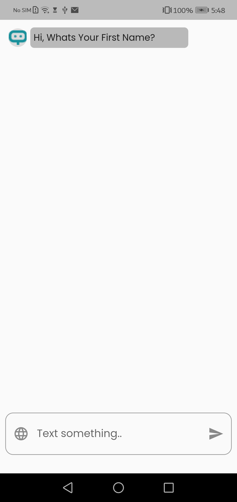

# Oranso_chat
It is a place where you meet the experts beside on your interests

## Table of contents
* [General info](#general-info)
* [Demo](#demo)
* [Technologies](#technologies)
* [How to use](#how-to-use)
* [Project Structure](#project-structure)

## General info
This is an application named Oranso.The idea of this application is to help perople from different fields to contact each other whehter by the recommindation or by adding.Every expert has its own rate and also can add him/her to your favourite list.

### Demo
 * Video
<a href="https://drive.google.com/file/d/1CwEOVyOxbYZKQu5_a4g7MslzlaLFMasr/view?usp=sharing" target="_blank">Click here to see a demo</a>
* Images
<table>
  <tr>
    <td>First Screen Page</td>
     <td>Get Started</td>
  </tr>
  <tr>
    <td></td>
    <td></td>
  </tr>
  <tr>
    <td>Initial Chat</td>
     <td>Last question before choosing a checkbox</td>
       <td>Last question after choosing a checkbox</td>
  </tr>
  <tr>
    <td></td>
    <td>
    <td>
  </tr>
  <tr>
    <td>Home Page</td>
     <td>After clicking on favourite</td>
    <td>Scrolling the dragable sheet</td>
  </tr>
  <tr>
    <td></td>
    <td></td>
   <td></td>
  </tr>
 </table>


## Technologies
Project is created with:
* Flutter version: 3.3.2
* flutter_bloc: 8.1.1 

	
## How to use
#### Step1: you need to download or clone this repo
```
git clone https://github.com/SeifNagi/Oranso_chat.git
```
#### Step2: you need to get all dependencies
```
flutter pub get
```
#### Step 3: run the project
```
flutter run lib/main.dart
```
## Project Structure
```
Oranso_chat/
├── lib/
│   ├── bloc/
│   │   ├── chat_bloc
│   │   ├── chat_states
│   │   ├── reaction_state
│   │   └── reaction_bloc
│   ├── data/
│   │   ├── dome_data
│   │   ├── chat_model
│   │   └── reaction_model
│   └── presentation/
│       ├── page/
│       │   ├── chatPage 
│       │   └── homePage/
│       │       └── components
│       ├── style 
│       └── widget
└── assets/
    ├── home
    ├── getStarted
    └── splash
```
